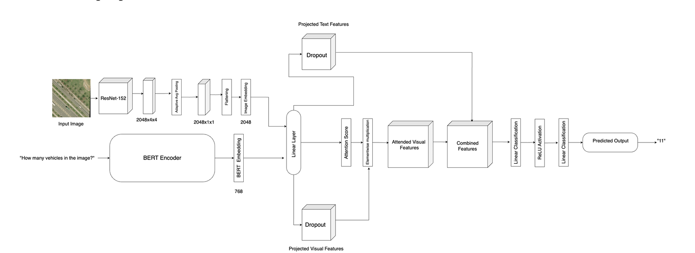
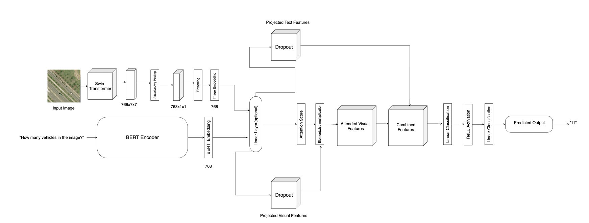

# Remote Sensing Visual Question Answering (RSVQA)

A deep learning-based **Remote Sensing Visual Question Answering (RSVQA)** framework that answers natural language questions related to satellite and aerial imagery.

This project combines **Computer Vision** and **Natural Language Processing (NLP)** techniques to build multimodal systems capable of understanding remote sensing images and generating accurate answers for user-defined questions.

---

## Overview

Visual Question Answering (VQA) aims to answer questions based on visual content. In the remote sensing domain, this task becomes more challenging because satellite images contain complex spatial patterns, varying scales, and high-resolution scenes.

This work proposes two multimodal architectures:

1. **ResNet-152 + BERT + Bilinear Attention**
2. **Swin Transformer + BERT + Bilinear Attention**

Both architectures learn meaningful representations from images and textual questions and fuse them to predict the final answer.

---

## Model Architecture

### 1. ResNet-152 + BERT + Bilinear Attention

The first architecture utilizes a Convolutional Neural Network (CNN) backbone for extracting visual information.

#### Workflow

1. The input remote sensing image is passed through a pretrained **ResNet-152** network.
2. ResNet-152 extracts high-level visual features representing important objects, textures, and spatial information present in the image.
3. The natural language question is encoded using **BERT**.
4. Visual and textual representations are combined using a **Bilinear Attention Mechanism**.
5. The fused representation is passed through fully connected layers to predict the answer.



---

### 2. Swin Transformer + BERT + Bilinear Attention

1. The input image is divided into non-overlapping patches.
2. The patches are processed using a **Swin Transformer**.
3. The question is encoded using **BERT**.
4. Bilinear Attention fuses visual and textual information.
5. The fused representation is used for answer prediction.



---

## Bilinear Attention Fusion Mechanism

The project employs a **Bilinear Attention Mechanism** to effectively combine image and textual information.

Instead of simply concatenating image and question embeddings, bilinear attention learns fine-grained interactions between visual and textual features and focuses on image regions that are most relevant to the given question.

This selective attention significantly improves multimodal understanding and enhances answer prediction accuracy.

---

## Dataset

### RSVQA Dataset

https://rsvqa.sylvainlobry.com/

### HRVQA Dataset

https://github.com/Manuscripts-code/HRVQA

Please download the datasets from their official sources and update the dataset paths before training or evaluation.

---

## Repository Structure

```bash
RSVQA-System/
│
├── notebooks/
│   └── swimberta1.ipynb
│
├── weights/
│
├── assets/
│   ├── architectures/
│   │   ├── Resnet Model.png
│   │   └── Swin Model.png
│   │
│   ├── results/
│   │
│   └── samples/
│       └── samplersvqa.jpg
│
├── README.md
└── requirements.txt
```

---

## Installation

```bash
git clone https://github.com/your-username/RSVQA-System.git
cd RSVQA-System
pip install -r requirements.txt
```

## Running the Project

```bash
jupyter notebook notebooks/swimberta1.ipynb
```

## Evaluation Metrics

- Accuracy
- Precision
- Recall
- F1-Score
- Confusion Matrix

Example Sample from RSVQA Dataset:


---

## Technologies Used

- Python
- PyTorch
- Transformers (Hugging Face)
- ResNet-152
- Swin Transformer
- BERT
- Bilinear Attention

---

## Publication

This work has been published in the proceedings of the **2025 International Conference on Computing, Intelligence, and Application (CIACON)**.

**Paper:** *Visual Question Answering on Remote Sensing Data*

**Authors:** Vishal Gour, Mousum Handique, Sourish Dhar, Atul Ukey, Devendra Kumar Jangid, and Shubham Bairwa

**Paper Link:** https://ieeexplore.ieee.org/document/11189410

```bibtex
@inproceedings{gour2025visual,
  title={Visual Question Answering on Remote Sensing Data},
  author={Gour, Vishal and Handique, Mousum and Dhar, Sourish and Ukey, Atul and Jangid, Devendra Kumar and Bairwa, Shubham},
  booktitle={2025 International Conference on Computing, Intelligence, and Application (CIACON)},
  pages={1--6},
  year={2025},
  organization={IEEE}
}
```

## Acknowledgements

This work was carried out under the guidance of **Dr. Sourish Dhar**, Assistant Professor, Department of Computer Science and Engineering, Assam University, Silchar.
